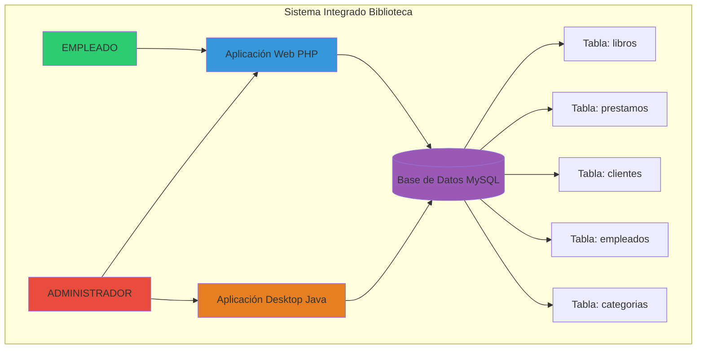
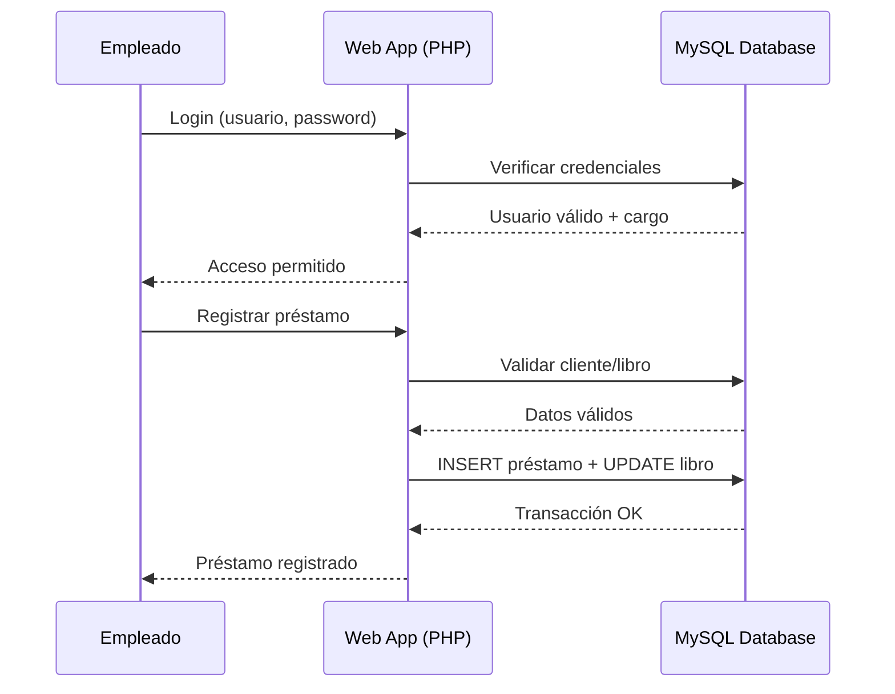
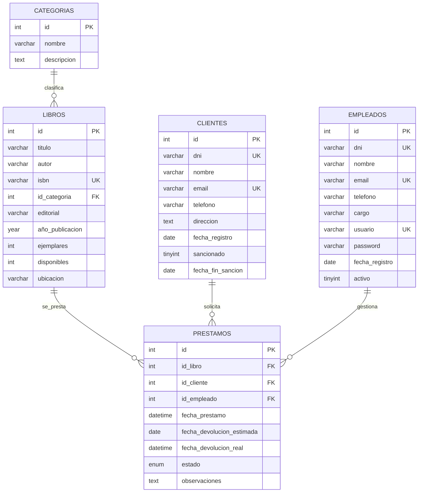
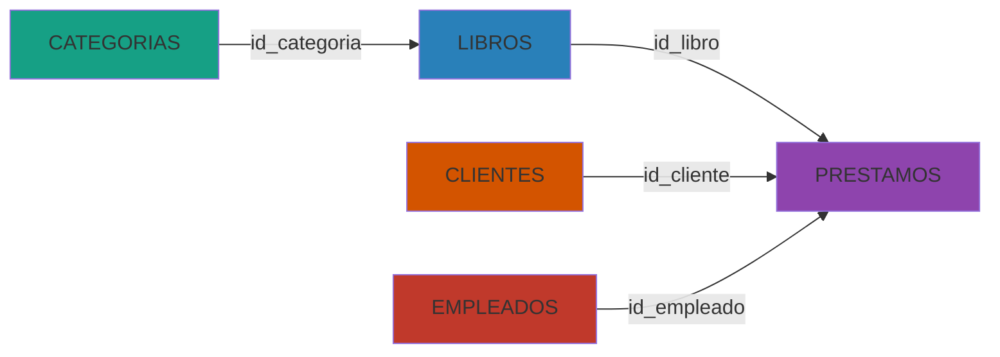
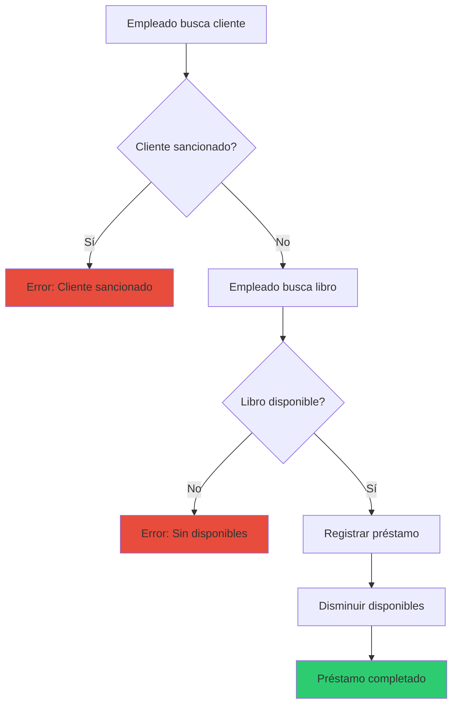
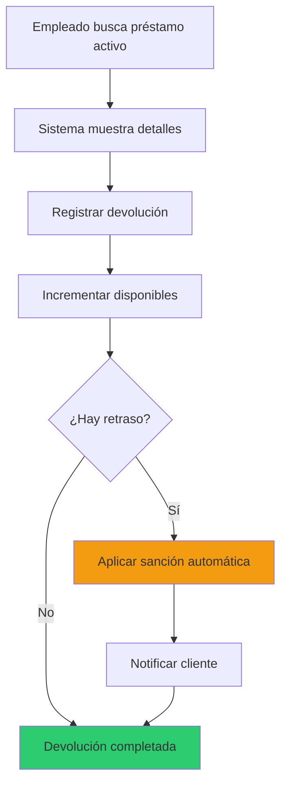

# Sistema de Gestión de Biblioteca

**Solución Integral para Bibliotecas Públicas**

Fernanda González
Acceso a Datos

---

## Visión del Proyecto

### Sistema Dual Integrado

**Aplicación Web (PHP)** - Operaciones diarias
**Aplicación Desktop (Java)** - Administración
**Base de Datos MySQL** - Persistencia unificada

---

## Arquitectura del Sistema



---

## Flujo de Datos



---

## Base de Datos - gestion_biblioteca

### Diagrama Entidad-Relación



---

## Tabla: categorias

| Campo | Tipo | Nulo | Clave | Default | Extra |
|-------|------|------|-------|---------|-------|
| id | int(11) | NO | PRI | NULL | auto_increment |
| nombre | varchar(200) | NO | | NULL | |
| descripcion | text | YES | | NULL | |

**Propósito**: Clasificar libros por temática
**Relación**: 1 categoría → N libros

---

## Tabla: libros

| Campo | Tipo | Nulo | Clave | Default |
|-------|------|------|-------|---------|
| id | int(11) | NO | PRI | auto_increment |
| titulo | varchar(200) | NO | | NULL |
| autor | varchar(100) | NO | | NULL |
| isbn | varchar(20) | NO | UNI | NULL |
| id_categoria | int(11) | YES | MUL | NULL |
| editorial | varchar(100) | YES | | NULL |
| año_publicacion | year(4) | YES | | NULL |
| ejemplares | int(11) | YES | | 1 |
| disponibles | int(11) | YES | | 1 |
| ubicacion | varchar(50) | YES | | NULL |

---

## Tabla: clientes

| Campo | Tipo | Nulo | Clave | Default |
|-------|------|------|-------|---------|
| id | int(11) | NO | PRI | auto_increment |
| dni | varchar(20) | NO | UNI | NULL |
| nombre | varchar(100) | NO | | NULL |
| email | varchar(100) | NO | UNI | NULL |
| telefono | varchar(20) | YES | | NULL |
| direccion | text | YES | | NULL |
| fecha_registro | date | NO | | NULL |
| sancionado | tinyint(1) | YES | | 1 |
| fecha_fin_sancion | date | YES | | NULL |

**Lógica**: sancionado=1 (activo), sancionado=0 (sancionado)

---

## Tabla: empleados

| Campo | Tipo | Nulo | Clave | Default |
|-------|------|------|-------|---------|
| id | int(11) | NO | PRI | auto_increment |
| dni | varchar(20) | NO | UNI | NULL |
| nombre | varchar(100) | NO | | NULL |
| email | varchar(100) | NO | UNI | NULL |
| telefono | varchar(20) | YES | | NULL |
| cargo | varchar(50) | YES | | 'empleado' |
| usuario | varchar(50) | NO | UNI | NULL |
| password | varchar(200) | NO | | NULL |
| fecha_registro | date | NO | | NULL |
| activo | tinyint(1) | YES | | 1 |

**Cargos**: 'admin' o 'empleado'

---

## Tabla: prestamos

| Campo | Tipo | Nulo | Default |
|-------|------|------|---------|
| id | int(11) | NO | auto_increment |
| id_libro | int(11) | NO | NULL |
| id_cliente | int(11) | NO | NULL |
| id_empleado | int(11) | NO | NULL |
| fecha_prestamo | datetime | YES | current_timestamp() |
| fecha_devolucion_estimada | date | NO | NULL |
| fecha_devolucion_real | datetime | YES | NULL |
| estado | enum | YES | 'activo' |
| observaciones | text | YES | NULL |

**Estados**: 'activo', 'devuelto', 'atrasado'

---

## Relaciones entre Tablas



**Tabla central**: PRESTAMOS conecta todas las entidades

---

## Roles y Permisos

| Rol | Aplicación | Acceso BD | Funcionalidades |
|-----|-----------|-----------|-----------------|
| **Empleado** | Web PHP | Lectura/Escritura limitada | Gestionar libros<br>Registrar préstamos<br>Gestionar clientes<br>Aplicar sanciones |
| **Admin** | Desktop Java | Lectura/Escritura completa | CRUD empleados<br>Configuración sistema<br>Auditoría completa |

---

## Aplicación Web - Tecnologías

### Stack Frontend
- **HTML5 + CSS3**: Interfaz moderna y responsive
- **JavaScript ES6+**: Lógica del cliente
- **Fetch API**: Comunicación asíncrona

### Stack Backend
- **PHP 8.2**: Lógica de negocio
- **MySQL 8.0**: Base de datos relacional
- **DTO's/MySQLi**: Acceso a datos seguro

---

## Sistema de Autenticación

### Flujo de Login (PHP + JavaScript)

```php
// api/login.php
$sql = "SELECT id, nombre, cargo FROM empleados 
        WHERE usuario = ? 
        AND password = SHA2(?, 256) 
        AND activo = 1";

$stmt = $conn->prepare($sql);
$stmt->bind_param("ss", $usuario, $password);
$stmt->execute();

if ($result->num_rows > 0) {
    $_SESSION['usuario_id'] = $empleado['id'];
    $_SESSION['usuario_cargo'] = $empleado['cargo'];
    echo json_encode(['success' => true]);
}
```

---

## Fetch API - Comunicación Asíncrona

### JavaScript (Cliente)

```javascript
fetch('api/login.php', {
    method: 'POST',
    headers: {
        'Content-Type': 'application/json',
    },
    body: JSON.stringify({
        usuario: usuario,
        password: password
    })
})
.then(response => response.json())
.then(data => {
    if (data.success) {
        window.location.href = 'dashboard.php';
    }
});
```

---

## Gestión de Préstamos

### Registro de Préstamo (PHP)

```php
// api/registrar_prestamo.php
$conn->begin_transaction();

try {
    // 1. Insertar préstamo
    $sql = "INSERT INTO prestamos 
            (id_libro, id_cliente, id_empleado, 
             fecha_devolucion_estimada) 
            VALUES (?, ?, ?, ?)";
    
    // 2. Disminuir disponibilidad
    $sql = "UPDATE libros 
            SET disponibles = disponibles - 1 
            WHERE id = ?";
    
    $conn->commit();
} catch (Exception $e) {
    $conn->rollback();
}
```

---

## Búsqueda Inteligente

### Búsqueda de Libros con Autocompletado

```php
// api/buscar_libro.php
$sql = "SELECT l.id, l.titulo, l.autor, 
               l.disponibles, c.nombre as categoria
        FROM libros l
        LEFT JOIN categorias c ON l.id_categoria = c.id
        WHERE l.titulo LIKE ? 
           OR l.autor LIKE ? 
           OR l.isbn LIKE ?
        ORDER BY l.titulo ASC
        LIMIT 10";

$stmt->bind_param("sss", $searchTerm, 
                         $searchTerm, 
                         $searchTerm);
```

---

## Búsqueda - Frontend JavaScript

```javascript
function buscarLibroPrestamo(query) {
    if (query.length < 2) return;
    
    fetch(`api/buscar_libro.php?q=${encodeURIComponent(query)}`)
        .then(response => response.json())
        .then(libros => {
            mostrarResultados(libros);
        });
}

function mostrarResultados(libros) {
    const html = libros.map(libro => `
        <div onclick="seleccionar(${libro.id})">
            ${libro.titulo} - ${libro.autor}
            <span>${libro.disponibles} disponibles</span>
        </div>
    `).join('');
}
```

---

## Sistema de Validaciones

### Backend (PHP) - Validación de Sanción

```php
// Verificar cliente sancionado
$sql = "SELECT sancionado, fecha_fin_sancion 
        FROM clientes WHERE id = ?";

if ($cliente['sancionado'] == 0) {
    echo json_encode([
        'success' => false, 
        'message' => 'Cliente sancionado hasta: ' 
                   . $fecha_fin_sancion
    ]);
    exit();
}

// Verificar disponibilidad libro
if ($libro['disponibles'] <= 0) {
    echo json_encode([
        'success' => false,
        'message' => 'Sin ejemplares disponibles'
    ]);
    exit();
}
```

---

## Seguridad Implementada

### Medidas de Protección

- **Prepared Statements**: Prevención SQL Injection
- **Password Hashing**: SHA-256 para contraseñas
- **Validación de Sesiones**: Control de acceso
- **Escape de Datos**: htmlspecialchars() en salidas
- **HTTPS Ready**: Compatible con SSL/TLS
- **Control de Roles**: Middleware de autorización

---

## Dashboard Administrativo

### Estadísticas en Tiempo Real

- Total de libros y disponibilidad
- Clientes activos vs sancionados
- Préstamos activos y atrasados
- Top 5 libros más prestados
- Libros por categoría con métricas

```php
$sql = "SELECT COUNT(*) as total,
        SUM(CASE WHEN sancionado = 1 
            THEN 1 ELSE 0 END) as activos
        FROM clientes";
```

---

## Gestión de Transacciones

### Ejemplo: Devolución de Libro

```php
$conn->begin_transaction();

try {
    // 1. Actualizar préstamo
    UPDATE prestamos 
    SET fecha_devolucion_real = NOW(),
        estado = 'devuelto'
    WHERE id = ?
    
    // 2. Incrementar disponibilidad
    UPDATE libros 
    SET disponibles = disponibles + 1
    WHERE id = ?
    
    $conn->commit();
} catch (Exception $e) {
    $conn->rollback();
}
```

---

## Aplicación Desktop - Java

### Tecnologías

- **Java Swing**: Interfaz gráfica nativa
- **JDBC**: Conexión a MySQL
- **MVC Pattern**: Arquitectura limpia
- **Maven**: Gestión de dependencias

### Función Exclusiva
**CRUD completo de empleados** (solo admin)

---

## Código Java - Conexión BD

```java
public class DatabaseConnection {
    private static final String URL = 
        "jdbc:mysql://localhost:3306/gestion_biblioteca";
    
    public static Connection getConnection() 
        throws SQLException {
        return DriverManager.getConnection(
            URL, "usuario", "password"
        );
    }
}

// Uso
try (Connection conn = DatabaseConnection.getConnection()) {
    PreparedStatement stmt = conn.prepareStatement(
        "SELECT * FROM empleados WHERE cargo = ?"
    );
    stmt.setString(1, "admin");
    ResultSet rs = stmt.executeQuery();
}
```

---

## Funcionalidades Clave

### Gestión de Préstamos
- Registrar nuevo préstamo
- Registrar devolución
- Control de préstamos atrasados
- Búsqueda por cliente o ID

### Gestión de Clientes
- CRUD completo de clientes
- Sistema de sanciones automático
- Datos de contacto actualizables

---

## Funcionalidades Clave (2)

### Gestión de Libros
- CRUD de libros y categorías
- Control de inventario (disponibles)
- Organización por categorías
- Búsqueda por título, autor, ISBN

### Panel Administrativo
- Estadísticas detalladas
- Rankings de libros
- Gestión de empleados (Desktop)

---

## Flujo de Trabajo: Préstamo



---

## Flujo de Trabajo: Devolución



---

## Instalación y Despliegue

### Requisitos del Sistema

**Servidor:**
- Apache 2.4+ / Nginx
- PHP 8.2+
- MySQL 8.0+
- mod_rewrite habilitado

**Cliente:**
- Navegadores modernos (Chrome, Firefox, Safari)
- JavaScript habilitado

---

## Pasos de Instalación

### 1. Configurar Base de Datos

```bash
# Crear base de datos
mysql -u root -p
CREATE DATABASE gestion_biblioteca;

# Importar estructura
mysql -u root -p gestion_biblioteca < schema.sql
```

### 2. Configurar Conexión

```php
// includes/conexion.php
$host = 'localhost';
$dbname = 'gestion_biblioteca';
$username = 'tu_usuario';
$password = 'tu_password';
```

---


### 3. Configurar Servidor Web

```bash
# Copiar archivos
cp -r biblioteca-web /var/www/html/

# Ajustar permisos
chmod 755 /var/www/html/biblioteca-web
chmod 644 /var/www/html/biblioteca-web/*.php

# Reiniciar servidor
sudo systemctl restart apache2
```

### 4. Acceder al Sistema
```
http://localhost/biblioteca-web/login.php
Usuario: admin
Password: admin123
```

---

## Ventajas Competitivas

### Vs. Sistemas Tradicionales

| Característica | Sistema Tradicional | Nuestro Sistema |
|----------------|-------------------|-----------------|
| Interfaz | Anticuada | Moderna y responsive |
| Búsqueda | Manual/Lenta | Autocompletado rápido |
| Transacciones | Propensas a error | Atomicidad garantizada |
| Seguridad | Básica | Multi-capa |
| Escalabilidad | Limitada | Arquitectura modular |

---

## Casos de Uso Reales

### Biblioteca Universitaria
- **10,000+ libros** en catálogo
- **5,000+ estudiantes** registrados
- **500+ préstamos/día** en época de exámenes
- **Tiempo de préstamo**: menos de 30 segundos

### Biblioteca Municipal
- Gestión de **3 sucursales**
- Atención a **todas las edades**
- **Catálogo compartido** entre sedes

---

## Soporte y Mantenimiento

### Servicios Incluidos

- **Actualizaciones de seguridad** mensuales
- **Backups automáticos** diarios
- **Monitoreo 24/7** de servidor
- **Documentación completa** en español
- **Capacitación** al equipo (2 sesiones)
- **Migración de datos** desde sistema anterior

---

## Sobre el Proyecto

**Desarrolladora**: Fernanda González Alvarenga
**Formación**: 2º DAM - Acceso a Datos
**Año**: 2025-2026

### Tecnologías Dominadas
- Backend: PHP, Java
- Frontend: HTML, CSS, JavaScript
- Bases de Datos: MySQL
- Arquitectura: MVC, REST APIs
- Control de Versiones: Git

---


# Gracias por su Atención

## ¿Preguntas?

### Sistema de Gestión de Biblioteca
*Transformando la experiencia bibliotecaria*

---

**Contacto**: sihayclasehoy@gmail.com
**Portfolio**: github.com/fxndx5
**LinkedIn**: linkedin.com/in/fernanda-gonzalez